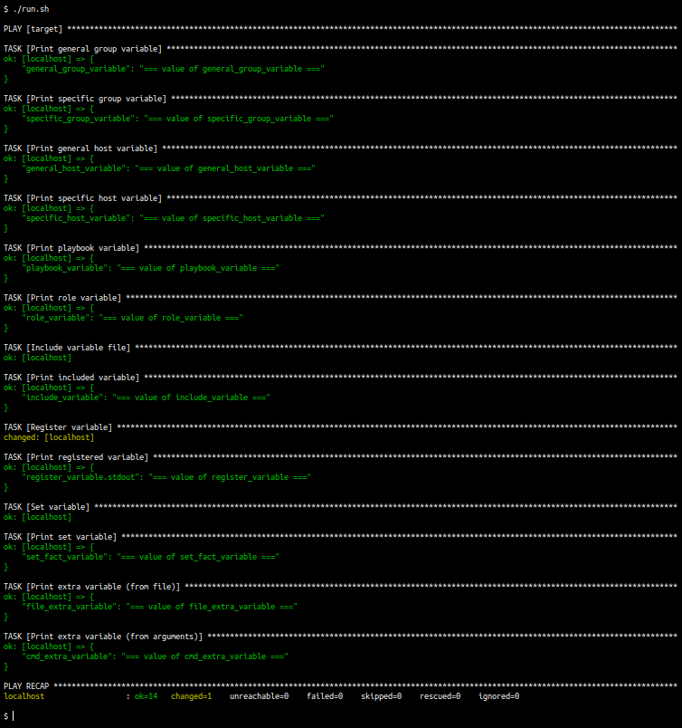

# Ansible Variables

Simple and concise example of all possible cases for variable definition and usage in Ansible.

### Prerequisites

* basic knowledge of Ansible
* locally installed python3
* locally installed ansible

### Notes

* no variable value overwriting
* variables are printed in precedence order (ascending)
* role definition is available in `./roles` directory
* everything is executed on localhost

### Setup

1. repository clone
2. execute `./run.sh`

### Example

