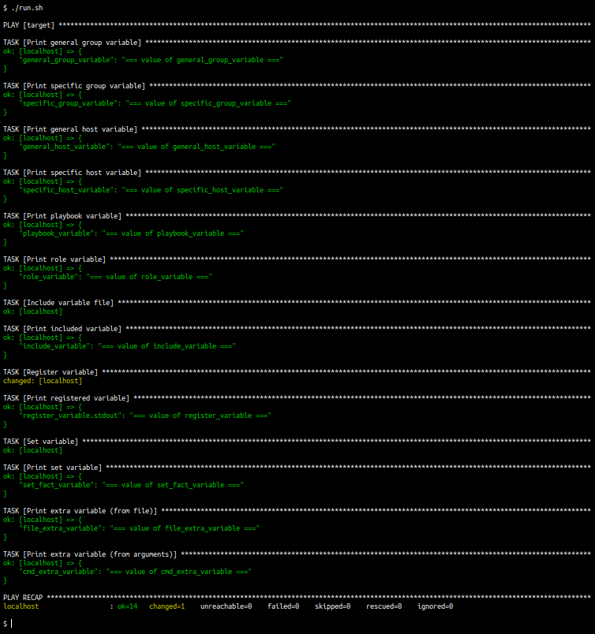

# Ansible Variables

Simple and concise example of the most common cases for variable definition and usage in Ansible. [Ansible documentation](https://docs.ansible.com/ansible/latest/user_guide/playbooks_variables.html) describes all possible cases for variable definition as well as the evaluation precedence.

### Prerequisites

* basic knowledge of Ansible
* locally installed python3
* locally installed ansible

### Notes

* no variable value overwriting
* variables are printed in precedence order (ascending)
* role definition is available in `./roles` directory
* everything is executed on localhost

### Setup

1. repository clone
1. execute `./run.sh`

### Example

